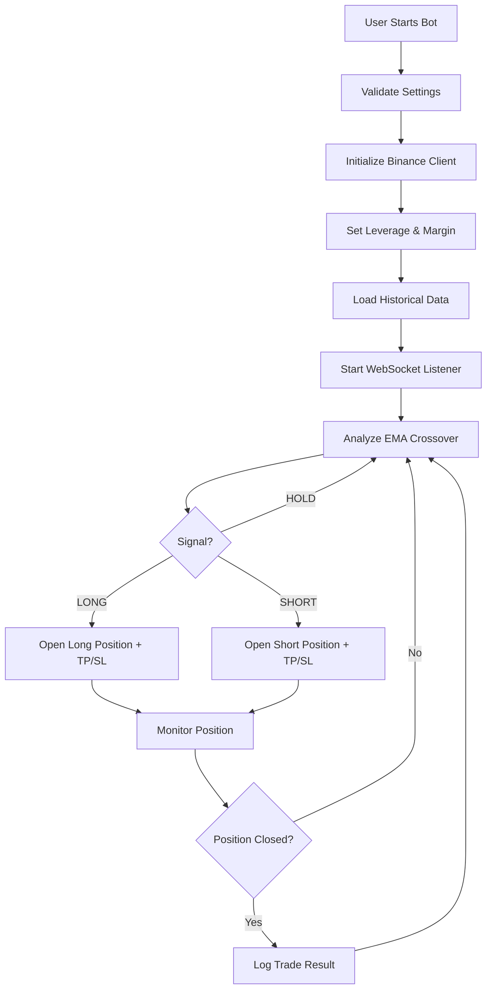

# 🚀 EzyagoTrading - Advanced Multi-User Futures Trading Bot

**Professional SaaS platform for automated cryptocurrency futures trading with Binance integration.**

## ✨ **Key Features**

### 🔥 **Multi-User Support**
- **Secure user authentication** via Firebase
- **Individual API key management** with encryption
- **Subscription-based access** with trial periods
- **Admin panel** for user management

### 🤖 **Advanced Bot System**
- **Up to 4 simultaneous bots** per user
- **EMA crossover strategy** (9/21 periods)
- **Automatic TP/SL management** with custom percentages
- **Real-time WebSocket monitoring**
- **Smart position management**

### 📱 **Modern Interface**
- **Responsive design** (mobile & desktop)
- **Real-time price updates**
- **Interactive charts** and indicators
- **Multi-language support** (TR/EN)
- **Dark theme** with professional styling

### 🛡️ **Security & Risk Management**
- **Encrypted API key storage**
- **Configurable leverage** (1x-125x)
- **Position size limits**
- **Stop-loss protection**
- **Subscription validation**

## 🏗️ **System Architecture**

```
├── app/
│   ├── __init__.py
│   ├── main.py              # FastAPI application
│   ├── config.py            # Configuration management
│   ├── bot_core.py          # Individual bot logic
│   ├── bot_manager.py       # Multi-bot management
│   ├── binance_client.py    # Binance API wrapper
│   ├── trading_strategy.py  # EMA crossover strategy
│   ├── firebase_manager.py  # Firebase integration
│   └── utils/
│       └── crypto.py        # Encryption utilities
├── static/
│   ├── index.html           # Main web interface
│   ├── admin.html           # Admin panel
│   ├── script.js            # Frontend logic
│   ├── admin.js             # Admin panel logic
│   └── style.css            # Professional styling
├── requirements.txt         # Python dependencies
├── .env.example            # Environment variables template
└── README.md               # This file
```

## 🚀 **Quick Start**

### 1. **Clone Repository**
```bash
git clone https://github.com/yourusername/ezyagotrading.git
cd ezyagotrading
```

### 2. **Install Dependencies**
```bash
pip install -r requirements.txt
```

### 3. **Configure Environment**
```bash
cp .env.example .env
# Edit .env with your Firebase and other settings
```

### 4. **Generate Encryption Key**
```bash
python -c "from cryptography.fernet import Fernet; print(Fernet.generate_key().decode())"
```

### 5. **Setup Firebase**
1. Create a Firebase project
2. Enable Authentication and Realtime Database
3. Download service account JSON
4. Add Firebase config to `.env`

### 6. **Set Admin User**
```bash
python set_admin_claim.py
```

### 7. **Run Application**
```bash
uvicorn app.main:app --reload
```

## ⚙️ **Configuration**

### **Key Environment Variables**

| Variable | Description | Default |
|----------|-------------|---------|
| `MAX_BOTS_PER_USER` | Maximum bots per user | 4 |
| `DEFAULT_LEVERAGE` | Default leverage setting | 10 |
| `DEFAULT_STOP_LOSS_PERCENT` | Default stop loss % | 2.0 |
| `DEFAULT_TAKE_PROFIT_PERCENT` | Default take profit % | 4.0 |
| `TRIAL_PERIOD_DAYS` | Free trial duration | 7 |
| `MONTHLY_SUBSCRIPTION_PRICE` | Subscription price (USDT) | 15.0 |

### **Trading Strategy Settings**

```python
# EMA Crossover Parameters
EMA_SHORT_PERIOD = 9    # Fast EMA
EMA_LONG_PERIOD = 21    # Slow EMA

# Risk Management
MIN_ORDER_SIZE_USDT = 10.0
MAX_ORDER_SIZE_USDT = 10000.0
MIN_LEVERAGE = 1
MAX_LEVERAGE = 125
```

## 🔧 **API Endpoints**

### **Bot Management**
```http
POST /api/bot/start          # Start trading bot
POST /api/bot/stop           # Stop trading bot  
GET  /api/bot/status         # Get bot status
GET  /api/bot/symbols        # Get available symbols
```

### **User Management**
```http
POST /api/user/save-keys     # Save API keys
GET  /api/user/profile       # Get user profile
GET  /api/user/trades        # Get trade history
```

### **Admin Panel**
```http
GET  /api/admin/users              # List all users
POST /api/admin/activate-subscription # Extend subscription
GET  /api/admin/system-stats       # System statistics
```

### **Market Data**
```http
GET /api/market/ticker/{symbol}    # Get symbol price data
```

## 📊 **Bot Logic Flow**



## 🛡️ **Security Features**

- **🔐 Encrypted API Storage**: User API keys encrypted with Fernet
- **🔑 Firebase Authentication**: Secure user sessions
- **⏰ Token Validation**: Real-time authentication checks
- **📊 Subscription Control**: Automatic bot shutdown on expiry
- **🚫 Rate Limiting**: Protection against API abuse
- **🔒 Admin Controls**: Privileged access management

## 📱 **Supported Platforms**

- **💻 Desktop**: Full-featured web interface
- **📱 Mobile**: Responsive design with touch controls
- **🌐 Browsers**: Chrome, Firefox, Safari, Edge
- **🔗 API**: RESTful endpoints for integration

## 🎯 **Trading Strategy**

### **EMA Crossover Logic**
- **Long Signal**: 9 EMA crosses above 21 EMA
- **Short Signal**: 9 EMA crosses below 21 EMA
- **Hold**: No crossover detected

### **Risk Management**
- **Stop Loss**: Automatic based on percentage
- **Take Profit**: Automatic based on percentage
- **Position Sizing**: User-configurable per trade
- **Max Positions**: Limited to 4 per user

## 📈 **Performance Optimization**

- **⚡ WebSocket Connections**: Real-time data streaming
- **🔄 Connection Pooling**: Efficient API usage
- **💾 State Management**: Persistent bot status
- **🚀 Async Processing**: Non-blocking operations
- **📊 Smart Polling**: Optimized status updates

## 🐛 **Troubleshooting**

### **Common Issues**

1. **Bot Won't Start**
   - Check API keys validity
   - Verify subscription status
   - Ensure symbol is available

2. **Position Not Opening**
   - Check account balance
   - Verify leverage settings
   - Review position size limits

3. **WebSocket Disconnections**
   - Network connectivity issues
   - Binance server maintenance
   - Rate limiting triggered

### **Debug Mode**
```bash
# Enable detailed logging
export ENABLE_DEBUG_LOGS=True
export LOG_LEVEL=DEBUG
uvicorn app.main:app --reload --log-level debug
```

## 🔄 **Deployment**

### **Production Setup**
```bash
# Use production WSGI server
gunicorn app.main:app -w 4 -k uvicorn.workers.UvicornWorker

# Or with Docker
docker build -t ezyagotrading .
docker run -p 8000:8000 ezyagotrading
```

### **Environment Variables for Production**
```bash
ENVIRONMENT=LIVE
DEBUG=False
LOG_TO_FILE=True
MAINTENANCE_MODE=False
```

## 📄 **License & Legal**

⚠️ **Important Disclaimers:**

- **High Risk**: Cryptocurrency trading involves substantial risk
- **No Guarantees**: Past performance doesn't guarantee future results
- **Educational Purpose**: This software is for educational purposes
- **User Responsibility**: Users are responsible for their trading decisions
- **API Compliance**: Users must comply with Binance API terms

## 🤝 **Contributing**

1. Fork the repository
2. Create a feature branch
3. Commit your changes
4. Push to the branch
5. Create a Pull Request

## 📞 **Support**

- **📧 Email**: support@ezyagotrading.com
- **💬 Discord**: [Join our community](https://discord.gg/ezyagotrading)
- **📖 Documentation**: [Visit our docs](https://docs.ezyagotrading.com)
- **🐛 Issues**: [GitHub Issues](https://github.com/yourusername/ezyagotrading/issues)

## 🔄 **Version History**

- **v5.0.0** - Multi-user SaaS platform with advanced features
- **v4.0.0** - Multi-coin support and improved UI
- **v3.0.0** - Firebase integration and user management
- **v2.0.0** - Take Profit system and better error handling
- **v1.0.0** - Basic EMA crossover bot

---

**⚡ Built with FastAPI, Firebase, and modern web technologies**

*Made with ❤️ for the trading community* 
